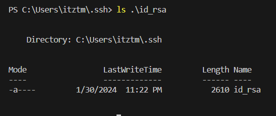
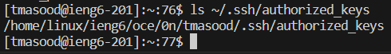

# **Lab Report 2**

***

## Part 1: ChatServer

```
import java.io.IOException;
import java.net.URI;

class Handler implements URLHandler {
    // The one bit of state on the server: a number that will be manipulated by
    // various requests.
    String message = "";

    public String handleRequest(URI url) {
        if (url.getPath().equals("/")) {
            return "Enter a message and user";
        } else {
            if (url.getPath().contains("/add-message")) {
                String[] parameters = url.getQuery().split("=");
                String[] parameters2 = parameters[1].split("&");
                
                if (parameters2[1].equals("user")){
                    message += String.format("%s: ", parameters[2]);
                }
                if (parameters[0].equals("s")) {
                    message += String.format("%s\n", parameters2[0]);
                    return message;
                }
                
            }
            return "404 Not Found!";
        }
    }
}

class ChatServer {
    public static void main(String[] args) throws IOException {
        if(args.length == 0){
            System.out.println("Missing port number! Try any number between 1024 to 49151");
            return;
        }

        int port = Integer.parseInt(args[0]);

        Server.start(port, new Handler());
    }
}
```

In this first screenshot, `/add-message?s=Hello&user=tmasood` was added to the url. In my code, the `handleRequest` method was called. Also in this method, the getPath() method was called, which checks to see which arguments were passed into the url. The main value in this class is `String message`. It is where the full message is concatenated after the parameters are split. Before the request is made, `message` is an empty string. After the request is made, `message` becomes `tmasood: Hello`. Also, the main method in the `ChatServer` class is also called, which starts the server.

The same methods from the first screenshot are being called. The argument is changed to `/add-message?s=How are you&user=Me`. The main difference between this screenshot and the first is that the username and message are different. This means that the `message` variable is being updated. Also, the previous values are not erased, they are just added on. The `URI url` value that is being passed as an argument for the `handleRequest` method is updated every time the url is updated.
## Part 2: SSH Key

Private Key:



Public Key:



Logging on without a password:


## Part 3: New Information
Something new that I learned in these labs is that it is possible to run a server using Java. You are also able to modify data on the page by changing the url.
