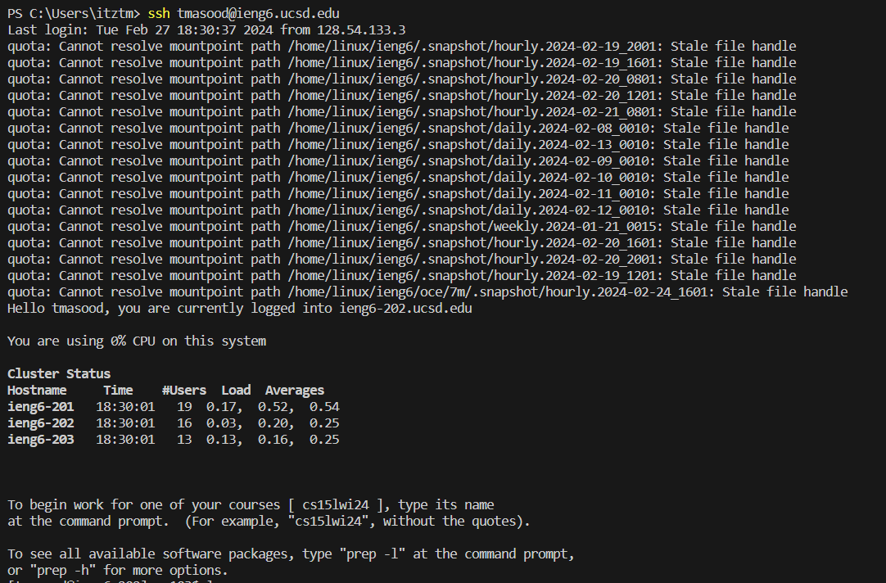
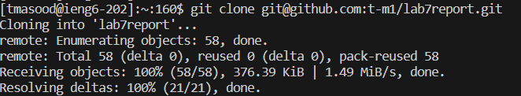
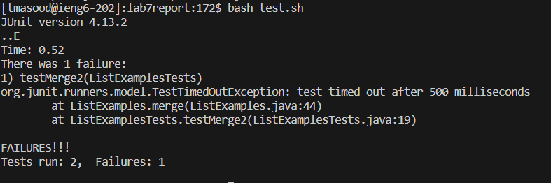
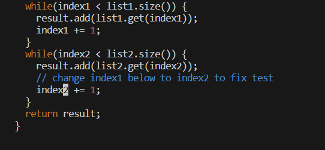
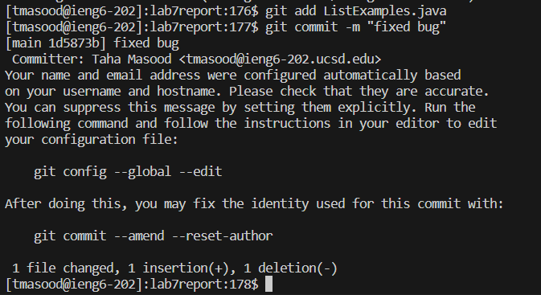
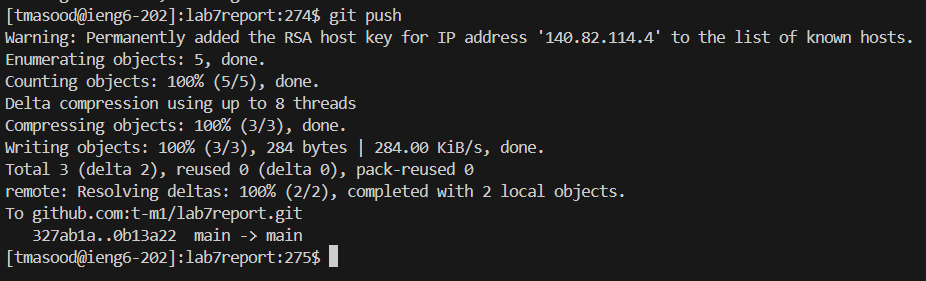

# **Lab Report 4**

***

## Step 1: Log into ieng6

Keys Pressed: `ssh<space>tmasood@ieng6.ucsd.edu<enter>`. I typed this command to log onto the server. Since I have already set up the public and private keys, I am able to log in without having to type my password.
## Step 2: Clone fork of repository

Keys Pressed: `git clone<space><rightclick><enter>`. I copied the ssh url and pasted it using right click to clone the repository. 
## Step 3: Run tests, showing failure

Keys Pressed: `bash<space>test.sh<enter>`. I ran the test script, which compiles and runs the JUnit tests for me. 
## Step 4: Edit code to fix

Keys Pressed: `vim<space>ListExamples.java<enter>`, `/index1<enter>`, `<shift>nexi2<esc>:wq<enter>`. Firstly, I used `vim` to edit the file `ListExamples.java`. Then, I used `/` to find where index1 appeared. Next, I used `<shift>n` to jump to the last index1, and typed `nexi2` to change the 1 in index 1 to a 2. Finally, I saved and exited using `:wq`.
## Step 5: Run tests, showing success

Keys Pressed: `<up><up><enter>`. The `bash test.sh` command was 2 up in the search history, so i used up arrow to access it.
## Step 6: Commit and push results

Keys Pressed: `git<space>add<space>ListExamples.java<enter>`, `git<space>commit<space>-m<space>"fixed<space>bug"<enter>`, `git<space>push<enter>. I ran the `git add`, `git commit`, and `git push` commands, which update the file, commit, and push the results onto my Github account. My commit message was `fixed bug`.
