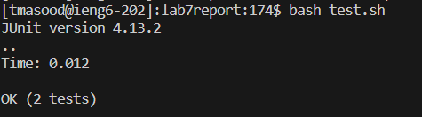

# **Lab Report 4**

***

## Step 1: Log into ieng6

## Step 2: Clone fork of repository

## Step 3: Run tests, showing failure

## Step 4: Edit code to fix

## Step 5: Run tests, showing success

## Step 6: Commit and push results

