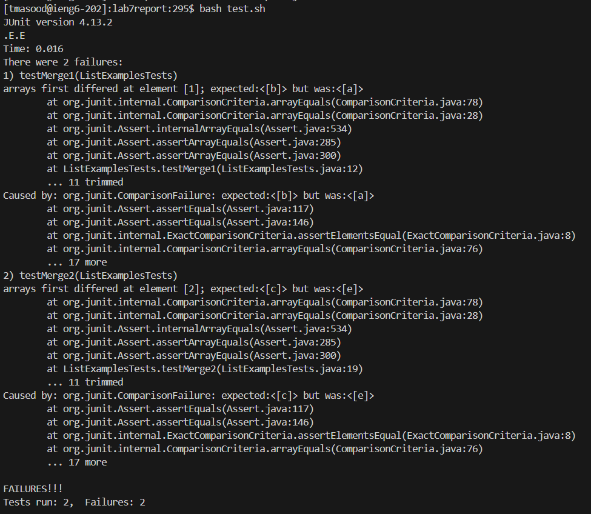

# **Lab Report 4**

***

# Part 1: Debugging Scenario
## 1. Original Post

I was working on `ListExamples.java` and there seems to be a bug in my code because both of my tests cases are not passing. It seems like the values in the array are not matching up to what they should be. This may be because one or both of the two lists that are being merged are not being successfully updated with the necessary information. 
