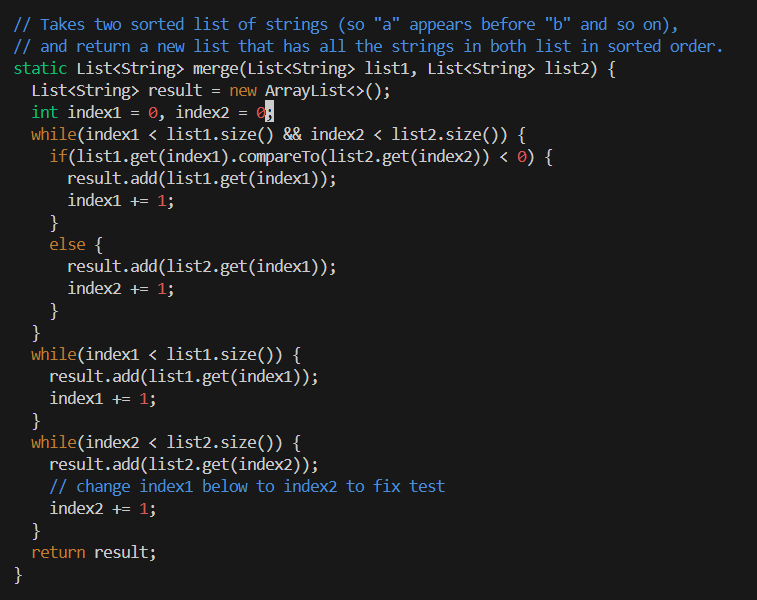

# **Lab Report 5**

***

# Part 1: Debugging Scenario
## 1. Original Post


I was working on `ListExamples.java` and there seems to be a bug in my code because both of my tests cases are not passing. It seems like the values in the array are not matching up to what they should be. This may be because one or both of the two lists that are being merged are not being successfully updated with the necessary information.
## 2. TA Response

Thank you for the question. I believe that you are on to something. Look through `ListExampples.java` and see where each of the two lists that are being passed into the `merge` function are being updated. Look through the logic and see if it makes sense. Do you see any inconsistencies between which list is being updated at which time?
## 3. Follow up Response


Looking through the code, I found an `if else` statement in which index1 is being added to the result no matter what comparison is made. One of these needs to be changed for the code to function properly.
## 3. All Information
File/Directory Structure
```
lab7report/
  |-  lib/
    |- hamcrest-core-1.3.jar
    |- junit-4.13.2.jar
  |-  ListExamples.java
  |-  ListExamplesTests.java
  |-  test.sh
```

ListExamples.java
```
 static List<String> merge(List<String> list1, List<String> list2) {
    List<String> result = new ArrayList<>();
    int index1 = 0, index2 = 0;
    while(index1 < list1.size() && index2 < list2.size()) {
      if(list1.get(index1).compareTo(list2.get(index2)) < 0) {
        result.add(list1.get(index1));
        index1 += 1;
      }
      else {
        result.add(list2.get(index1));
        index2 += 1;
      }
    }
    while(index1 < list1.size()) {
      result.add(list1.get(index1));
      index1 += 1;
    }
    while(index2 < list2.size()) {
      result.add(list2.get(index2));
      // change index1 below to index2 to fix test
      index2 += 1;
    }
    return result;
  }
```

test.sh
```
javac -cp .:lib/hamcrest-core-1.3.jar:lib/junit-4.13.2.jar *.java
java -cp .:lib/hamcrest-core-1.3.jar:lib/junit-4.13.2.jar org.junit.runner.JUnitCore ListExamplesTests
```

Command Line to trigger the bug: `bash test.sh`
To fix this bug, in the first `if-else` statement, in the `else` section, you have to change `result.add(list2.get(index1));` to `result.add(list2.get(index2));`. This will make it so both of the lists that are being merged are being updated correctly.

# Part 2: Reflection

Before I started this class, I had very little understanding of how Git worked and its applications. In the second half of the class, I was able to learn what committing meant, and how to push updates entirely from the command line. This information will be very helpful in my future classes and my career.
